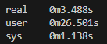

# What is the One Billion Row Challenge?

The [One Billion Row Challenge](https://github.com/gunnarmorling/1brc) is a 
challenge in Java to aggregate information as fast as possible. I personally
thought that it would be a  great way to learn more lower level concepts, as
well as how to profile a program, so I tried doing this in C++.

The code I wrote is in the same repository as this writeup, but as this writeup
is a cleaned up version of the code, it might not look exactly the same.

## Problem Statement

We are given a file containing 1 billion temperature measurements, keyed by
the station name, and we need to compute the min, average and max temperatures
seen by each station.

For context, the data looks something like this:

```
Hamburg;12.0
Bulawayo;8.9
Palembang;38.8
St. John's;15.2
Cracow;12.6
Bridgetown;26.9
Istanbul;6.2
Roseau;34.4
Conakry;31.2
Istanbul;23.0
```

And we are supposed to provide the output in the following manner:

```
{Abha=-23.0/18.0/59.2, Abidjan=-16.2/26.0/67.3, Abéché=-10.0/29.4/69.0, Accra=-10.1/26.4/66.4, Addis Ababa=-23.7/16.0/67.0, Adelaide=-27.8/17.3/58.5, ...}
```

So, let's create a straightforward program to quickly set a baseline! We first have a struct to contain all the information on a per weather station basis, and store the information in a map. 

```C++
struct Information {
    double min = std::numeric_limits<double>().max();
    double max = std::numeric_limits<double>().min();
    double sum = 0;
    int64_t num_measurements = 0;
}

std::map<std::string, Information> measurements;
```

We then parse each row for the measurement and toss it into the map.

```C++
std::string row;
while (std::getline(inputFile, row)) {
    // Format of each row
    // <string: station name>;<double: measurement>
    size_t idx = row.find(';');
    std::string station_name = row.substr(0, idx);
    std::string measurement_str = row.substr(idx + 1);
    double measurement = std::stod(measurement_str);

    Information& info = measurements[station_name];
    info.num_measurements++;
    info.sum += measurement;
    info.max = std::max(info.max, measurement);
    info.min = std::min(info.min, measurement);
}
```

Lastly, we just need to iterate over the map to print out the values in sorted 
order. On my computer with an AMD Ryzen 3 3300X and 32 GB of RAM at 2666 MHz, 
this takes approximately 3 minutes and 20 seconds, or 200s total.

## Optimizations

Due to how simple the problem statement is, there is not much to be gained by 
using a better algorithm. Instead, we will need to look at ways to directly 
improve the speed of the algorithm. I'll detail five optimizations I made for my 
program.

### Optimization 1: Fixed Point Integers

One of the issues I faced when writing the first solution was inaccuracies due 
to floating point operations. Looking at the constraints on the data:

> Temperature value: non null double between -99.9 (inclusive) and 99.9 (inclusive), always with one fractional digit

It it clear that we don't actually need to work with doubles. Ignoring the 
period, we are actually working with integers from -999 to 999. Working with 
integers would be quite a bit faster as well, so:

```C++
struct Information {
    int64_t min = std::numeric_limits<int64_t>().max();
    int64_t max = std::numeric_limits<int64_t>().min();
    int64_t sum = 0;
    int64_t num_measurements = 0;

    inline void print(...) { ... }
}
```

With the main loop now looking like:

```C++
std::string row;
while (std::getline(input, row)) {
    size_t idx = row.find_last_of(';');
    int64_t measurement = parse_measurement(row.c_str() + idx + 1);
    row.erase(idx);

    Information& info = measurements[row];
    ...
}
```

Instead of deferring to `std::atoi` or something similar, we can create a more specific function for obtaining the temperature value.

```C++
inline int64_t parse_measurement(const char *curr) {
    int64_t sign = 1;
    if (*curr == '-') {
        curr++;
        sign = -1;
    }

    int64_t measurement = (*curr - '0') * 10;
    ++curr;

    if (*curr != '.') {
        measurement = (measurement + *curr - '0') * 10;
        ++curr;
    }

    ++curr;
    measurement += *curr - '0';
    measurement *= sign;
    return measurement;
}
```

This reduces the time from 200s to 112s, over 40% in improvement!

### Optimization 2: Use a Hashmap

Using  `perf record -g`, we obtain


One of the "functions" with high usage is `memcmp`, with over 46% of the time
being spent within that function. Looking at the code, the only significant
place with comparisons would be the tree lookup/insertion step.

Thus, I experimented with using a hashmap instead of a tree-based map.
`std::unordered_map` does work, but uses linked lists to resolve hash collisons.
I decided to try [`ankerl::unordered_dense::map`](https://github.com/martinus/unordered_dense)
instead, which resolves conflicts using open addressing. This should improve
performance from cache locality.

This then requires us to do a one-time sort at the end to ensure our output is
in the correct order.

```C++
ankerl::unordered_dense::map<std::string, Information> measurements;
measurements.reserve(5000);
{
    // Main loop
    std::string row;
    while (std::getline(input, row)) ...
}

std::vector<std::pair<std::string, Information>> all(measurements.begin(), measurements.end());
std::sort(all.begin(), all.end(), [](auto &lhs, auto &rhs){
    return lhs.first < rhs.first;
});

// Print
...
```

This brings the solution down to 35.1s, another 69% reduction in runtime! 

### Optimization 3: `mmap`

According to `perf`, one of the major time sinks is in `std::getline`. It makes
sense, it needs to transfer the information from its internal buffer to the
string, and also needs to check where the endlines are. 

One function I learnt recently was `mmap`, which directly maps the contents of
a file to the virtual memory space of the program. Instead of the program
managing an internal cache, we let the OS manage the memory pages for us.

```C++
void Solutions::memory_map(const char* filename) {
    ...
    void *mapped = mmap(nullptr, fileSize, PROT_READ, MAP_PRIVATE, fd, 0);
    if (mapped == MAP_FAILED) {
        std::cerr << "Unable to mmap file.";
        close(fd);
        return;
    }
    
    const char *curr = static_cast<const char *>(mapped);
    const char *final = curr + fileSize;

    ankerl::unordered_dense::map<std::string, Information> measurements;
    measurements.reserve(5000);

    while (curr < fileSize) ...
}
```

While researching on how to use `mmap`, I also came across the C functions
`strchr` and `memchr`. [`memchr`](https://en.cppreference.com/w/c/string/byte/memchr) 
takes in a `char *` and a length, as well as a character `ch` to look for, and determines if the character is in that character array. `strchr` is similar,
except instead of taking a `char *` and a length, it takes a null-terminated
string.

In this case, what I wanted to do was to find the instance `;` so I can start
parsing the temperature. I know that `;` will definitely exist in the input, so
I tried [`rawmemchr`](https://linux.die.net/man/3/rawmemchr) instead, which is
`memchr` but without the length input. 

For some reason, `strchr` was faster than `rawmemchr` for me, despite whatever
I read online. Using `strchr` here is technically undefined behaviour since the
mmap'd file is not null terminated, but if it works it works :)

```C++
while (curr < final) {
    // Stores the start of the station name/measurement
    const char *start_of_row = curr; 

    curr = strchr(curr, ';');
    size_t idx = static_cast<size_t>(curr - start_of_row);

    std::string station_name(start_of_row, idx);
    int64_t measurement = parse_measurement(++curr);

    Information& info = measurements[station_name];
    info.num_measurements++;
    info.sum += measurement;
    info.max = std::max(info.max, measurement);
    info.min = std::min(info.min, measurement);

    curr = strchr(curr, '\n') + 1;
}
```

One thing I did realize though, at this point, was that I didn't need the `strchr`
at the end for the while loop, since `parse_measurement` would increment on the
pointer within that function. So, I modified the `parse_measurement` to take in
a pointer reference instead!

```C++
inline int64_t parse_measurement(const char* &curr) { ... }

void Solutions::memory_map(const char* filename) {
    ...
    while (curr < final) {
        ...
        curr += 2;
    }
    ...
}
```

This reduces the time down to 22.9s.

### Optimization 4: Eliminate Heap Allocations

While scouring for more places to optimize, one thing I noted was the use of 
`new` and `malloc`.


Looking at the code, we are allocating memory for the hashmap, for each 
`std::string` for the station name, and the final `std::vector` when we are 
providing the output. But if we think about it, we don't actually need to 
allocate a new `std::string` for each row of the input. We can actually just use
`std::string_view` and store a view of the data that is already loaded in memory!

The only change we need to do is to replace `std::string` with `std::string_view`:

```C++
void Solution::memory_map(const char* filename) {
    ...
    ankerl::unordered_dense::map<std::string_view, Information> measurements;
    measurements.reserve(5000);
    while (curr < final) {
        ...
        std::string_view station_name(start_of_row, idx);
        int64_t measurement = parse_measurement(++curr);

        Information& info = measurements[station_name];
        ...
    }

    std::vector<std::pair<std::string_view, Information>> all(...);
    ...
}
```

The code now runs in 13.4s! We have already improved upon the original code by
over an order of magnitude!

### Optimization 5: Threads

This is not really an optimization, but more of a use of all available compute
resource that we have access to. Since the task is embarassingly parallel, I 
used `std::thread` and split the code into `std::thread::hardware_concurrency()` 
number of chunks. Each of them have a preallocated hashmap, and the main thread 
will wait upon each thread. Once each thread is complete, the main thread 
combines each thread's aggregated information and then prints it out.

This brings the final runtime to 3.5s, a mere 1.8% of the original runtime!



### Further Possible Optimizations

I decided to stop here, though there are still a few ideas to improve the
runtime:

**Better Hash**

According to `perf`, the hashing for the `unordered_dense::map` takes about 10%
of the CPU's time. Although the challenge says its possible there to be up to
10000 unique station names of up to 100 bytes with no other restrictions, the
generated data takes from a list of about 400 names. We could perform a sort of 
analysis on these names to try to find a perfect hash function, which will
greatly improve the performance of the code for those specific inputs.

Alternatively, if we don't want to make assumptions about the exact station
names, we can also calculate the hash for the `string_view` at the same time
that we are finding the colon (in `strchr(curr, ';')`). This can save us a
linear number of reads.

**Branchless Parsing of Temperatures**

This is actually possible! Looking at the [winning solution](https://github.com/gunnarmorling/1brc/blob/main/src/main/java/dev/morling/onebrc/CalculateAverage_thomaswue.java#L307),
there is a way to obtain the temperature, even with the negative sign, without
any branches using bitwise operations.

**Even Distribution of Work**

Currently, I'm distributing roughly equal number of _bytes_ to be processed by
each thread. However, since each measurement is represented by each row, it is
possible that some thread, due to bad luck, has many more rows to process. 
Instead, we can break the input into many more chunks, with each thread
requesting for the next chunk when they are done.

## Closing Thoughts

I learnt quite a few things while experimenting! Here are some of them:

- **Introductory CMake**: I never needed to use CMake before, as usually I would
  just use the command line for the compiler directly. I guess it's not too bad
  for simple programs :)
- **Profiling C++ Programs**: `perf` was really helpful in finding ways to 
  improve the program. Definitely still have much more to learn in how to use
  it! I have been using WSL for most of the development, and `perf stat` only
  works on Linux, so I wasn't able to use that profiler.
- **Optimize for memory access over branching**: Obvious in hindsight. I
  originally tried to modify the measurement data to make it easier to parse,
  e.g. from `84.3` to `8430`. It did make it easier to parse, but `perf` showed
  a significant amount of time was spent in writing to the string, so I did
  what I showed above instead.
- **`strchr` is exceedingly fast**: We can write a simple program that fits the
    description of `strchr`:

    ```C++
    char *strchr(char *str, char ch) {
        while (*str != '\0') {
            if (*str == ch) return str;
            str++;
        }
        return nullptr;
    }
    ```

    However, if we tried to use this, we would generate code that is much slower
    than the compiler provided versions. My understanding is that `strchr` reads a
    [whole _word_](https://codebrowser.dev/glibc/glibc/string/strchrnul.c.html#29) 
    at a time, rather than an indvidual byte, and determines if the char in is that
    word. This is a concept called "SIMD Within A Register" (SWAR), and 
    [Wikipedia](https://en.wikipedia.org/wiki/SWAR#Finding_zero_bytes) has a 
    short description on this. Really cool!

Overall, this was a really fun experience. I might come back someday to try out
the further optmizations I left out, or perhaps other similar challenges.
